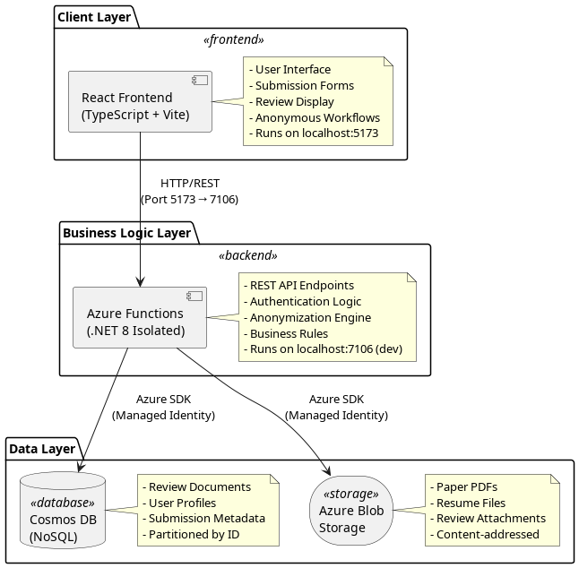
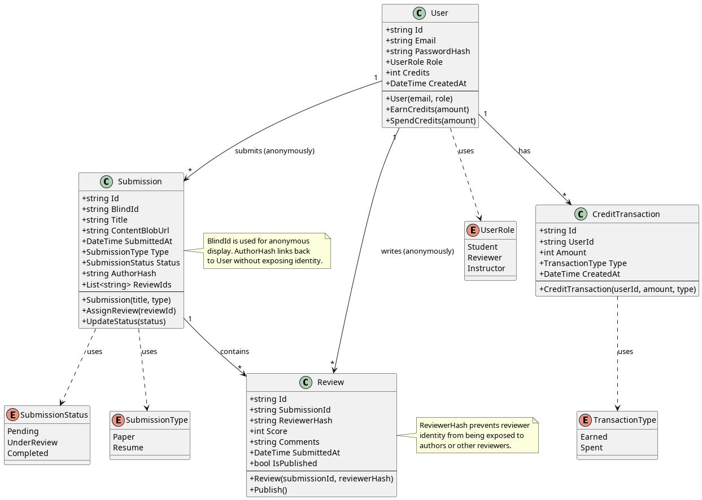
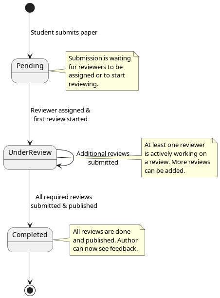
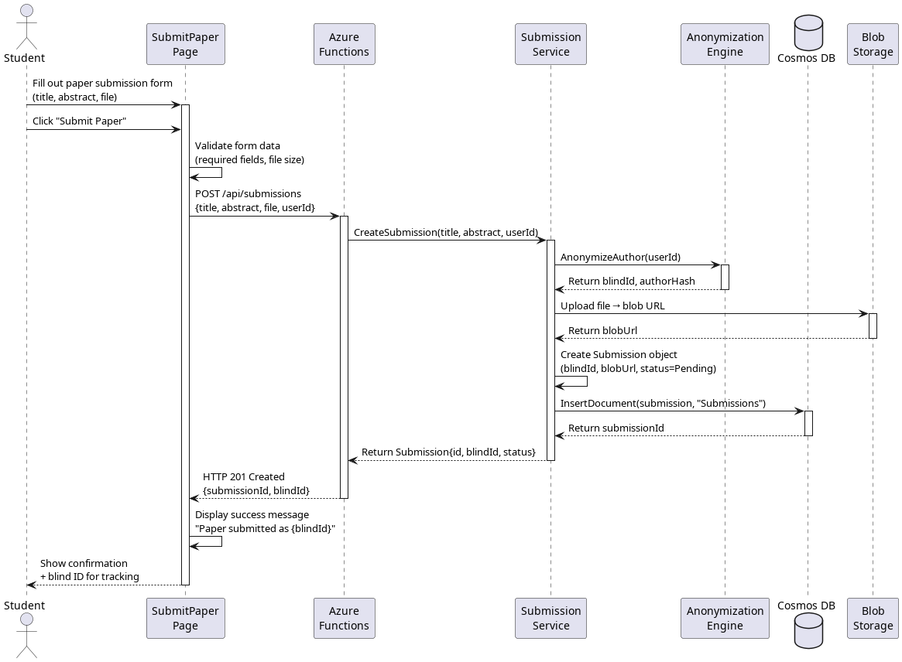
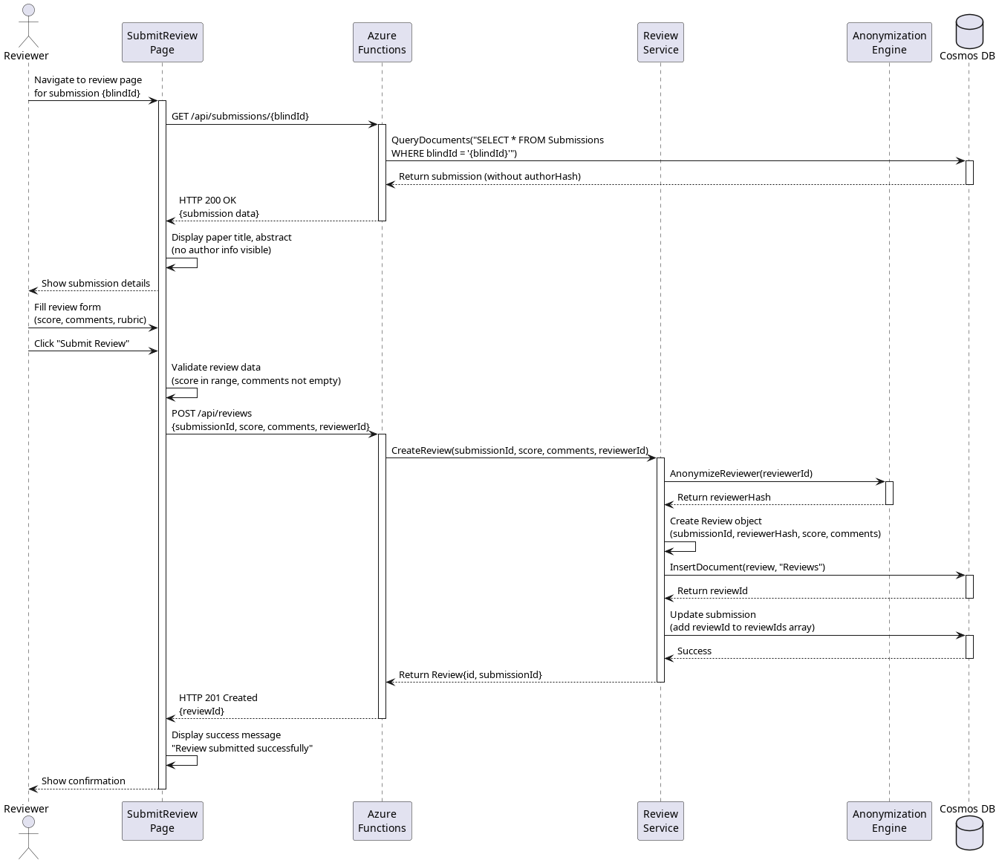

# High-Level Design (HLD) Document
# BlindReview: Anonymous Peer Review Platform

---

## Table of Contents
1. [Architecture Overview](#1-architecture-overview)
2. [Class Diagrams](#2-class-diagrams)
3. [Sequence Diagrams](#3-sequence-diagrams)
4. [State Diagrams](#4-state-diagrams)

---

## 1. Architecture Overview

### 1.1 Architectural Decisions

#### Decision 1: Three-Tier Architecture (Client-Server with Serverless Backend) 

**Rationale:**
- **Separation of Concerns:** Frontend (presentation), Backend (business logic), Database (persistence) are completely independent
- **Scalability:** Azure Functions auto-scale based on load without manual intervention
- **Development Velocity:** Team can work in parallel - Arsh on frontend, Markus on backend, minimal conflicts
- **Cost Efficiency:** Pay-per-execution model suits academic project with unpredictable usage patterns

**Alternatives Considered:**
- **Monolithic Full-Stack (Next.js/Express):** Rejected because it couples frontend and backend deployment, harder to scale independently
- **Microservices:** Overkill for a team of 3 and simple domain model
- **Traditional VM-hosted Backend:** Requires constant uptime and manual scaling; serverless eliminates this overhead

**Trade-offs:**
- **Pro:** Independent scaling and deployment
- **Pro:** No infrastructure management
- **Con:** Vendor lock-in to Azure ecosystem

**Constraints:**
- University provides Azure credits (free hosting)
- Team has experience with React and .NET
- Must support anonymous workflows (easier with stateless backend)

---

#### Decision 2: NoSQL Database (Azure Cosmos DB)

**Rationale:**
- **Flexible Schema:** Review documents vary (papers vs resumes, different rubrics), JSON documents handle this naturally
- **Global Distribution:** Cosmos DB replicates data across regions for low latency (future-proofing)
- **Managed Service:** No database admin required, automatic backups and scaling
- **Partition-Friendly:** Reviews can be partitioned by submission ID, enabling horizontal scaling

**Alternatives Considered:**
- **Relational Database (Azure SQL):** Rejected because schema evolution is harder; anonymous relationships don't fit rigid tables well
- **MongoDB on VM:** Requires self-management, no built-in global replication
- **Azure Table Storage:** Too simplistic for complex queries (e.g., "find all reviews by score > 3")

**Trade-offs:**
- **Pro:** Flexible document structure
- **Pro:** Built-in indexing and query capabilities
- **Con:** Higher cost than Table Storage
- **Con:** Eventual consistency model (acceptable for reviews, not financial transactions)

---

#### Decision 3: React + TypeScript Frontend

**Rationale:**
- **Type Safety:** Prevents entire classes of bugs at compile-time (e.g., passing wrong props to components)
- **Component Reusability:** Submission forms, review cards, status badges can be reused across epics
- **Developer Experience:** Vite HMR provides instant feedback, faster iteration
- **Ecosystem:** Rich library ecosystem (React Router, Axios, UI libraries)

**Alternatives Considered:**
- **Vue.js:** Team has more experience with React
- **Angular:** Too heavyweight for small team and simple domain
- **Plain JavaScript:** Rejected due to lack of type safety (critical for handling anonymous data correctly)

**Trade-offs:**
- **Pro:** Strong typing catches bugs early
- **Pro:** Large community and libraries
- **Con:** Steeper learning curve than plain JS
- **Con:** Build tooling complexity (mitigated by Vite)

---

#### Decision 4: REST API over HTTP/JSON

**Rationale:**
- **Simplicity:** Team knows REST, no learning curve
- **Tooling:** Easy to test with Postman, browser dev tools
- **Stateless:** Each request is independent, fits serverless model
- **Universal:** Any frontend can consume REST (future mobile app?)

**Alternatives Considered:**
- **GraphQL:** Overkill for simple CRUD operations; adds complexity
- **gRPC:** Requires binary serialization, harder to debug
- **WebSockets:** Not needed for current features (no real-time updates)

**Trade-offs:**
- **Pro:** Simple and well-understood
- **Pro:** Easy debugging and testing
- **Con:** Over-fetching data (e.g., fetching full review when only status is needed)
- **Con:** Multiple round-trips for related data (acceptable for our scale)

---

### 1.2 High-Level Architecture Diagram

**PlantUML Source:** [`diagrams/architecture.puml`](./diagrams/architecture.puml)



**Description:**
- **Frontend** handles UI and user interactions, proxies API calls to backend
- **Backend** enforces business rules, anonymizes data, coordinates between storage and database
- **Database** stores structured review data (metadata, scores, comments)
- **Blob Storage** stores large files (PDFs, documents) referenced by database records

---

### 1.3 Architectural Patterns

#### Pattern 1: Layered Architecture

**Structure:**
- **Presentation Layer:** React components, routing, UI state
- **API Layer:** Azure Functions HTTP triggers
- **Business Logic Layer:** Services and domain logic (.NET classes)
- **Data Access Layer:** Repository pattern (ICosmos interface abstracts Cosmos DB)

**Why Appropriate:**
- Clear separation of concerns
- Each layer can be tested independently
- Easy to swap implementations (e.g., mock ICosmos for unit tests)

**Example:**
```
Frontend (SubmitPaper.tsx)
  ↓ HTTP POST /api/submissions
Backend (SubmitPaperFunction.cs)
  ↓ Call SubmissionService.CreateSubmission()
Business Logic (SubmissionService.cs)
  ↓ Call ICosmos.InsertDocument()
Data Layer (Cosmos.cs)
  ↓ Azure Cosmos SDK
Database (Cosmos DB)
```

---

#### Pattern 2: Repository Pattern

**Implementation:**
- `ICosmos` interface defines database operations (Insert, Query, Update, Delete)
- `Cosmos.cs` implements the interface using Azure SDK
- Backend code depends on `ICosmos`, not concrete Cosmos SDK

**Why Appropriate:**
- Abstracts database details from business logic
- Easy to mock for testing (inject fake `ICosmos` in unit tests)
- Can swap databases without changing business logic code

---

#### Pattern 3: Anonymization Middleware

**Implementation:**
- Every submission/review goes through anonymization service before storage
- Author/reviewer metadata is hashed and stored separately
- Only blind IDs are exposed to reviewers

**Why Appropriate:**
- Core requirement of the platform is anonymity
- Centralized logic ensures no accidental identity leaks
- Easier to audit for privacy compliance

---

### 1.4 Dependencies and Constraints

#### Technical Dependencies:
- **Node.js v18+:** Required for Vite and React development
- **.NET 8 SDK:** Required for Azure Functions runtime
- **Azure Account:** Required for Cosmos DB and Blob Storage (free tier available)
- **Azure Functions Core Tools:** Required for local backend testing

#### Architectural Constraints:
- **Cosmos DB Document Size:** Maximum 2 MB per document (large files must go to Blob Storage)
- **Azure Functions Timeout:** 5-minute execution limit (sufficient for review operations)
- **Cold Start Latency:** Functions may take 2-3 seconds to start if idle (acceptable for our use case)
- **Browser CORS:** Vite proxy handles CORS in dev; Azure Functions must enable CORS in production

#### Business Constraints:
- **Anonymity Requirement:** No author/reviewer identity visible during review process
- **Auditability:** All actions must be logged for academic integrity
- **Scalability:** Must support 100+ concurrent users (class size)

---

## 2. Class Diagrams

### 2.1 Domain Model (Backend)

**PlantUML Source:** [`diagrams/class-backend.puml`](./diagrams/class-backend.puml)



**Key Relationships:**
- **Submission → Review:** One submission can have many reviews (1-to-many)
- **User → Submission:** User submits papers/resumes anonymously (tracked via hash)
- **User → Review:** User writes reviews anonymously (tracked via hash)
- **User → CreditTransaction:** User accumulates credits through reviews
- **Cosmos implements ICosmos:** Repository pattern for database abstraction

---

## 3. Sequence Diagrams

### 3.1 Use Case: Submit Paper for Review (E1 - Core Epic)

**PlantUML Source:** [`diagrams/sequence-submit-paper.puml`](./diagrams/sequence-submit-paper.puml)



**Description:**
1. Student fills out submission form with paper details and uploads PDF
2. Frontend validates input and sends POST request to backend
3. Backend anonymizes author identity (generates blind ID and author hash)
4. Paper PDF is uploaded to Blob Storage, URL is saved
5. Submission document is created and stored in Cosmos DB
6. Success response returned to frontend with blind ID
7. Student sees confirmation and can track submission via blind ID

---

### 3.2 Use Case: Submit Review for Submission

**PlantUML Source:** [`diagrams/sequence-submit-review.puml`](./diagrams/sequence-submit-review.puml)



**Description:**
1. Reviewer navigates to review page for a blind submission
2. Frontend fetches submission details (without author identity)
3. Reviewer sees paper title/abstract but no author info
4. Reviewer fills out review form with score and comments
5. Backend anonymizes reviewer identity (generates reviewer hash)
6. Review document is created and stored in Cosmos DB
7. Submission document is updated to link the new review
8. Success response returned to frontend
9. Reviewer sees confirmation

---

## 4. State Diagrams

### 4.1 Submission Lifecycle

**PlantUML Source:** [`diagrams/state-submission.puml`](./diagrams/state-submission.puml)



**State Descriptions:**

| State | Description | Triggers | Valid Transitions |
|-------|-------------|----------|-------------------|
| **Pending** | Paper submitted, awaiting review assignment | Student submits paper | → UnderReview (when first reviewer starts) |
| **UnderReview** | One or more reviewers actively reviewing | Reviewer accepts assignment | → UnderReview (more reviews added)<br>→ Completed (all reviews done) |
| **Completed** | All reviews submitted and published | Last required review submitted | → (Terminal state) |
